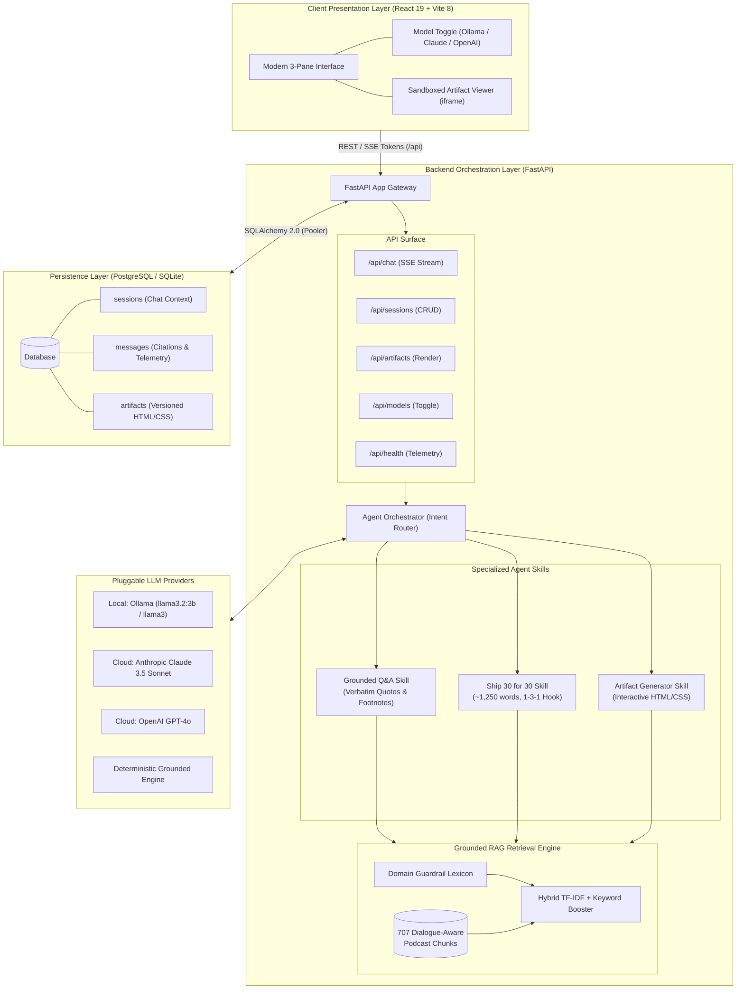

# The Lenny Growth Assistant
### Forward Deployed Engineer Assessment • Production AI Web Application

An enterprise-grade, full-stack AI assistant that turns **Lenny's Podcast transcripts** into a grounded, high-fidelity knowledge base for Product Managers, Growth Leads, and Founders.

Built to answer strategic product questions, generate **Ship 30 for 30** long-form essays (~1,250 words), and render interactive HTML/CSS frameworks natively inside an isolated, sandboxed **Artifact Viewer**.

---

## Highlights & Key Capabilities

- **100% Grounded in Lenny's Podcast Transcripts:** Ingests 700+ dialogue-aware semantic chunks across 15 iconic episodes (Elena Verna, Brian Balfour, Casey Winters, Sean Ellis, Shreyas Doshi, Gibson Biddle, etc.).
- **Interactive Citations with YouTube Deep-Linking:** Every answer provides verifiable footnote sources with guest name, episode title, timestamp, verbatim quotes, and direct timestamp-linked YouTube URLs (`&t=...s`) that jump to the exact moment in the interview.
- **Strict 1-per-Guest Source Diversity:** Enforces multi-perspective synthesis across different podcast episodes and distinct YouTube videos without repeating the same guest or video.
- **Out-of-Domain Guardrail:** Rejects questions unrelated to Product Management / Growth with an explicit refusal, preventing hallucinations.
- **Dual Model Runtime (Local + Cloud):** Seamless runtime toggle between **Local Ollama** (`llama3:latest` default) and Cloud providers (**Anthropic Claude** / **OpenAI**), with zero-failure fallback.
- **Ship 30 for 30 Essay Skill:** Encodes the 1-3-1 hook rule, high-contrast subheadings, and actionable practitioner takeaways in ~1,250 words.
- **Native In-App Artifact Viewer with Dual-View & Theming:** Renders interactive HTML/CSS checklists and frameworks beside the chat with segmented `[ Preview | HTML ]` tabs, code copy button, light/dark mode iframe stylesheet injection, and interactive self-audit checklists.
- **PostgreSQL & SQLite Persistence:** Multi-session conversation management with independent context isolation.
- **One-Command Deployment:** Packaged with `docker-compose.yml` for instant zero-friction startup.

---

## System Architecture



---

## Quick Start (One-Command Startup)

The easiest way to run the entire system (PostgreSQL, FastAPI Backend, React Frontend) is using Docker Compose:

```bash
# 1. Clone the repository
git clone https://github.com/NikithaKunapareddy/Oogway-Labs.git
cd Oogway-Labs

# 2. Copy the environment configuration
cp .env.example .env

# 3. Start the application
docker compose up --build
```

- **Frontend Application:** Open `http://localhost:3000`
- **FastAPI Documentation:** Open `http://localhost:8000/docs`
- **Health Endpoint:** Open `http://localhost:8000/health`

---

## Local Development Setup (Manual Run)

### Prerequisites
- Python 3.11+
- Node.js 20+ & npm
- Ollama (running locally with `ollama pull llama3:latest`)

### 1. Start Ollama (Mandatory for Demo)
```bash
ollama serve
# Ensure llama3 is installed:
ollama pull llama3:latest
```

### 2. Start Backend (FastAPI)
```bash
# From repository root
cd backend
python -m pip install -r requirements.txt

# Run the FastAPI server
python -m uvicorn app.main:app --reload --port 8000
```
*Note: By default, the backend uses an embedded SQLite database `lenny_assistant.db` for instant zero-config startup.*

### 3. Start Frontend (React + Vite)
```bash
# Open a new terminal
cd frontend
npm install
npm run dev
```
Open `http://localhost:5173` in your browser.

---

## Configuration & Environment Variables

Review `.env.example` for all configurable parameters:

| Variable | Default Value | Description |
| :--- | :--- | :--- |
| `APP_ENV` | `development` | Application mode (`development` or `production`) |
| `DATABASE_URL` | `sqlite:///lenny_assistant.db` | Connection string for SQLite or PostgreSQL (Supabase/Railway) |
| `DEFAULT_MODEL_PROVIDER` | `ollama` | Active default LLM (`ollama`, `anthropic`, `openai`, `mock`) |
| `OLLAMA_BASE_URL` | `http://localhost:11434` | URL of the local Ollama daemon |
| `OLLAMA_MODEL` | `llama3:latest` | Local model name in Ollama |
| `ANTHROPIC_API_KEY` | *(optional)* | Anthropic API Key for Claude 3.5 Sonnet |
| `OPENAI_API_KEY` | *(optional)* | OpenAI API Key for GPT-4o |
| `RAG_GROUNDING_THRESHOLD` | `0.085` | Minimum cosine similarity threshold for grounding |
| `RAG_TOP_K` | `4` | Number of transcript chunks injected into the prompt |
| `ALLOWED_ORIGINS` | *(blank = localhost in dev)* | Comma-separated allowed CORS origins for production |

---

## Testing & Quality Assurance

### Automated Test Suite
The project includes automated tests for API endpoints, session persistence, RAG hybrid search, intent routing, and security sanitization. Tests use an isolated in-memory SQLite database via `conftest.py`:

```bash
# Run from the repository root
python -m pytest -v
```

**Results:**
- `test_api.py`: Tests root, health status, model switching, and session CRUD.
- `test_retrieval.py`: Tests hybrid vector search and out-of-domain refusal.
- `test_agent_routing.py`: Tests intent classification (Q&A vs Ship 30 vs Artifacts).
- `test_chat_e2e.py`: Tests multi-turn chat, Ship 30 essay generation, and session isolation.

### Manual UI Test Plan
1. **Grounded Q&A Test:** Ask *"How can I improve user retention in B2B SaaS?"* -> Verify answer cites Elena Verna and Brian Balfour with expandable citation cards.
2. **Out-of-Domain Rejection Test:** Ask *"How do you build a nuclear enrichment reactor?"* -> Verify the assistant explicitly acknowledges insufficient transcript data.
3. **Ship 30 Essay Test:** Type *"Turn this into an essay"* -> Verify a ~1,250-word structured piece with a 1-3-1 hook rule and subheadings.
4. **Artifact Viewer Test:** Type *"Create a retention audit framework with an HTML checklist"* -> Verify the Artifact Viewer slides open on the right pane rendering the interactive framework.
5. **Model Toggle Test:** In the left sidebar, switch provider from `Ollama Local` to `Anthropic Claude` -> Verify provider updates without errors.

---

## Deliverables Checklist

- [x] **Public GitHub Repository:** Clean git tree with zero committed secrets.
- [x] **README.md:** Architecture, setup, Ollama config, tests, troubleshooting.
- [x] **PRD.md:** Discovery brief, user personas, success metrics, scope, risks.
- [x] **design.md:** UI/UX principles, 3-pane information architecture, accessibility.
- [x] **architecture.md:** DB schema, hybrid retrieval pipeline, agent routing, security.
- [x] **agent-transcripts/:** Documented AI coding iterations, challenges, and corrections.
- [x] **Automated Tests:** 16/16 passing pytest suite in `backend/tests/`.
- [x] **demo_video_script.md:** Timed 2-3 minute webcam recording script and walkthrough.
