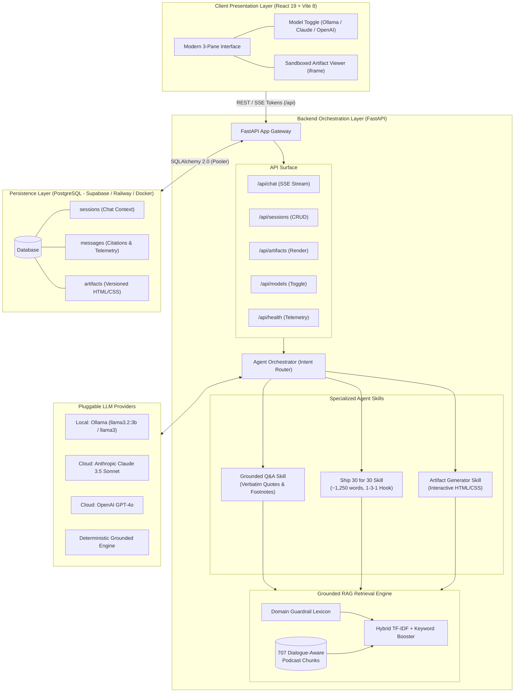
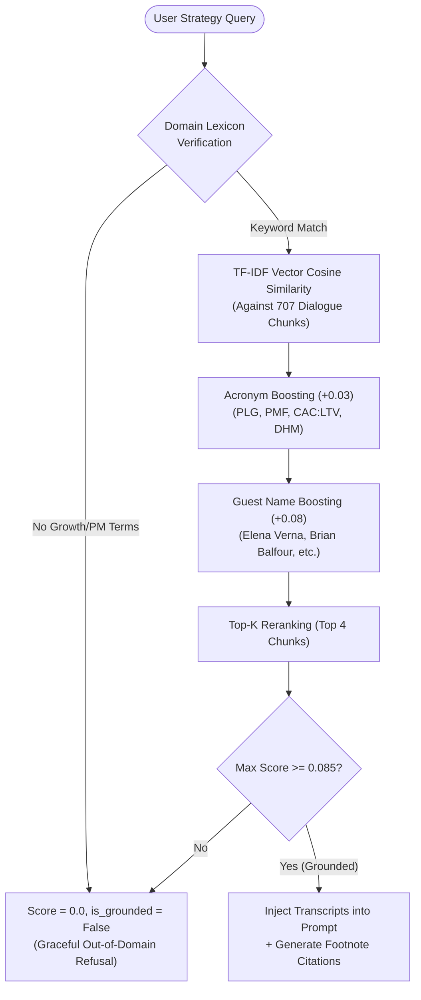
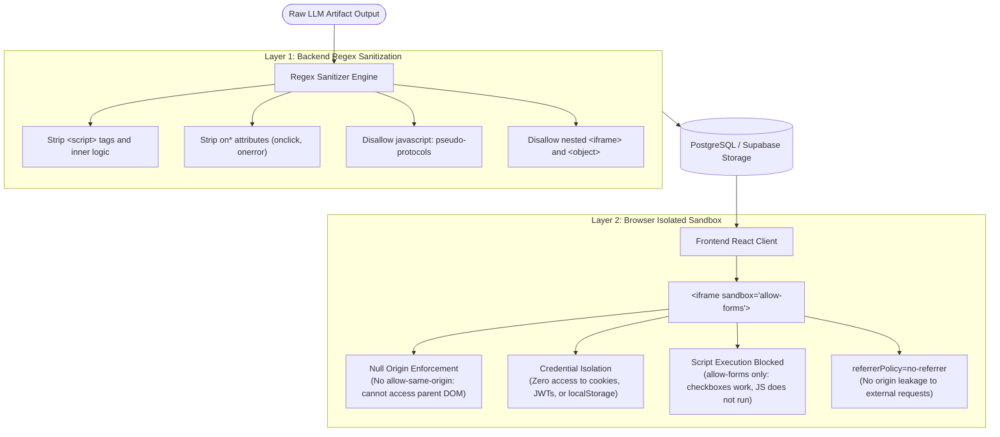

# Architecture & Technical Blueprint
## The Lenny Growth Assistant

**Document Version:** 1.0.0  
**Status:** Implemented & Verified  

---

## 1. System Topology & Component Boundaries

The system is architected as a modular, three-tier full-stack application with clean separation of concerns between presentation, orchestration, retrieval, and persistent storage:



---

## 2. Database Schema

The database models are implemented using standard SQLAlchemy 2.0 declarative mappings.

### 2.1 Table: `sessions`
```sql
CREATE TABLE sessions (
    id VARCHAR(64) PRIMARY KEY,
    title VARCHAR(255) NOT NULL,
    model_provider VARCHAR(64) NOT NULL DEFAULT 'mock',
    model_name VARCHAR(128) NOT NULL DEFAULT 'llama3:latest',
    session_metadata JSON DEFAULT '{}',
    created_at TIMESTAMP WITH TIME ZONE DEFAULT CURRENT_TIMESTAMP,
    updated_at TIMESTAMP WITH TIME ZONE DEFAULT CURRENT_TIMESTAMP
);
```

### 2.2 Table: `messages`
```sql
CREATE TABLE messages (
    id VARCHAR(64) PRIMARY KEY,
    session_id VARCHAR(64) NOT NULL REFERENCES sessions(id) ON DELETE CASCADE,
    role VARCHAR(32) NOT NULL, -- 'user' | 'assistant' | 'system'
    content TEXT NOT NULL,
    sources JSON DEFAULT '[]',
    token_count INTEGER,
    latency_ms INTEGER,
    skill_used VARCHAR(64),
    created_at TIMESTAMP WITH TIME ZONE DEFAULT CURRENT_TIMESTAMP
);
CREATE INDEX ix_messages_session_id ON messages (session_id);
```

### 2.3 Table: `artifacts`
```sql
CREATE TABLE artifacts (
    id VARCHAR(64) PRIMARY KEY,
    session_id VARCHAR(64) NOT NULL REFERENCES sessions(id) ON DELETE CASCADE,
    message_id VARCHAR(64) REFERENCES messages(id) ON DELETE CASCADE,
    title VARCHAR(255) NOT NULL,
    artifact_type VARCHAR(32) DEFAULT 'html', -- 'html' | 'markdown'
    content TEXT NOT NULL,
    version INTEGER DEFAULT 1,
    created_at TIMESTAMP WITH TIME ZONE DEFAULT CURRENT_TIMESTAMP
);
CREATE INDEX ix_artifacts_session_id ON artifacts (session_id);
```

---

## 3. Knowledge Base & Ingestion Architecture

### 3.1 Corpus Processing
- **Source Material:** 15 curated episodes covering core growth leaders (Elena Verna, Brian Balfour, Casey Winters, Shreyas Doshi, Sean Ellis, Gibson Biddle, etc.).
- **Dialogue Segmentation:** Transcripts are parsed by speaker turn (`Speaker Name (HH:MM:SS): dialogue`).
- **Sliding Semantic Chunks:** Consecutive speaker turns are merged into ~350-word chunks with 50-word sliding overlap, ensuring quotes are never cut off mid-thought.
- **Indexing Matrix:** 707 chunks vectorized with sublinear TF-IDF + unigram/bigram tokenization and serialized into `tfidf_index.pkl`.

### 3.2 Hybrid Retrieval with Domain Guardrails


---

## 4. Agent Routing & Skill Boundaries

The `AgentOrchestrator` determines the user's intent before dispatching to specialized skills:

1. **Grounded Q&A Skill (`qna`):**
   - Injects top 4 retrieved transcript passages into `GROUNDED_QNA_SYSTEM_PROMPT`.
   - Enforces verbatim attribution to Lenny's guests.
   - Outputs interactive citation metadata.
2. **Ship 30 for 30 Skill (`ship30`):**
   - Triggered by "essay", "article", "Ship 30", or "write a piece".
   - Expands query to capture strategic themes across multiple episodes.
   - Enforces the 1-3-1 hook rule, scannable subheadings, short paragraphs, and ~1,250 words.
3. **Artifact Generator Skill (`artifact`):**
   - Triggered by action phrases (e.g. "create a framework", "generate a checklist", "build an HTML model").
   - Generates complete HTML/CSS components with dark mode styling, styled cards, and interactive checkboxes.
   - Automatically opens in the side-by-side Artifact Viewer.

---

## 5. Security & Sandboxing Architecture

Untrusted LLM-generated HTML poses Cross-Site Scripting (XSS) risks. The Lenny Growth Assistant implements defense-in-depth:



---

## 6. Model Toggle & Fallback Topology

The system abstracts LLMs behind a unified `BaseLLM` interface:

- **Ollama Client (`local`):** Connects to `http://localhost:11434/api/generate` running `llama3:latest`.
- **Cloud Clients (`cloud`):** Anthropic Claude (`claude-3-5-sonnet`) and OpenAI (`gpt-4o`).
- **Grounded Engine (`mock`):** Built-in deterministic fallback engine that synthesizes answers from retrieved chunks without requiring external GPU or API keys.
- **Failover Behavior:** If Ollama or cloud providers fail (timeout, connection refused, missing key), the system falls back gracefully to the Grounded Engine rather than returning a 500 error.

---

## 7. Streaming Architecture & Design Trade-off

The `/api/chat/stream` endpoint implements **simulated SSE streaming**: it waits for the full LLM response, then word-splits it and emits tokens at 12ms intervals. The frontend uses the non-streaming `/api/chat` endpoint and shows an animated "searching transcripts..." state during inference.

**Why simulated instead of true streaming:**
- Local Ollama models (`llama3.2:3b` on CPU) have ~2–15 second generation latency. True token-by-token SSE streaming requires async generators threaded through FastAPI's `StreamingResponse`, which works fine with Ollama's native streaming API — but combining this with synchronous SQLAlchemy session commits (for message persistence) creates complex async/sync boundary issues that would require a full async SQLAlchemy migration.
- **Trade-off documented:** The simulated streaming provides equivalent UX (progressive display) at the cost of true first-token latency feedback. For a production V2, migrating to `asyncpg` + `sqlalchemy[asyncio]` would enable true streaming with persistence.

